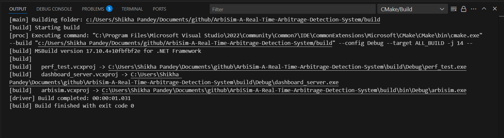
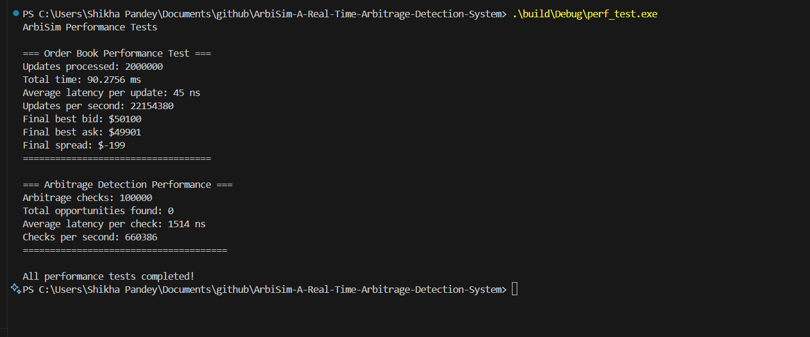

# ArbiSim - Real-Time Arbitrage Detection System

A high-performance, real-time cryptocurrency arbitrage detection and simulation system built in C++ with a modern web dashboard. ArbiSim identifies price discrepancies across multiple exchanges and provides comprehensive risk management with ultra-low latency processing.

## Project Overview

ArbiSim demonstrates professional-level understanding of high-frequency trading concepts, real-time systems architecture, and modern full-stack development. The system combines the performance of C++ for core processing with the flexibility of Node.js and web technologies for data visualization.

### Key Features

- **Ultra-Low Latency Processing**: Sub-microsecond arbitrage opportunity detection
- **Multi-Exchange Support**: Real-time price feeds from Binance, Coinbase, Kraken, and Bybit
- **Advanced Risk Management**: Position tracking, exposure limits, and drawdown protection
- **Real-Time Dashboard**: Professional trading interface with live data visualization
- **Performance Analytics**: Comprehensive metrics including latency tracking and P&L analysis
- **Lock-Free Architecture**: High-performance order book implementation for maximum throughput

## Project Structure

```
ArbiSim-A-Real-Time-Arbitrage-Detection-System/
├── .vscode/                    # VS Code configuration
├── build/                      # CMake build directory
├── dashboard/
│   └── dashboard.html          # Real-time web dashboard interface
├── include/
│   ├── arbisim_core.h         # Core trading engine components
│   ├── multi_exchange_feeds.h  # Exchange feed simulators
│   └── risk_management.h      # Risk management system
├── node_modules/               # Node.js dependencies
├── output/
│   ├── arbitrage_opportunities.csv  # Generated trading opportunities
│   ├── dashboard.mp4           # Dashboard demonstration video
│   ├── out.png                 # Build output screenshot
│   ├── output_arbitrage.mp4    # ArbiSim engine output video
│   ├── output_pref_test.png    # Performance test results
│   └── session_summary.txt     # Trading session summary
├── src/
│   ├── main.cpp               # Core ArbiSim engine
│   └── performance_test.cpp   # Performance benchmarking
├── tests/
│   └── performance_test.cpp   # Unit and performance tests
├── .gitignore
├── CMakeLists.txt             # Build configuration
├── LICENSE                    # MIT License
├── package.json               # Node.js dependencies
├── package-lock.json          # Dependency lock file
├── README.md                  # This file
├── session_summary.txt        # Latest session results
└── test-server.js            # WebSocket bridge server
```

## Architecture

The system follows a multi-tier architecture optimized for performance and maintainability:

### Core Components

1. **ArbiSim Engine (C++)**: High-performance trading engine with lock-free data structures
2. **WebSocket Bridge (Node.js)**: Real-time data transmission between C++ engine and web interface
3. **Web Dashboard (HTML/JavaScript)**: Professional trading interface with live visualizations
4. **CSV Data Bridge**: File-based communication ensuring data persistence and debugging capability

### Data Flow

```
C++ Engine → CSV File → Node.js Bridge → WebSocket → Web Dashboard
     ↓              ↓            ↓           ↓
Order Books → Opportunities → JSON Messages → Live UI Updates
```

## Requirements

### System Requirements

- **Operating System**: Windows 10/11 or macOS 10.15+
- **Compiler**: MSVC 2019+ (Windows) or Clang 12+ (macOS)
- **Node.js**: Version 14.0 or higher
- **Memory**: Minimum 4GB RAM (8GB recommended for optimal performance)
- **Storage**: 100MB available space

### Dependencies

#### C++ Dependencies
- CMake 3.15+
- C++17 compatible compiler
- Optional: Boost libraries (for advanced features)
- Optional: OpenSSL (for secure connections)

#### Node.js Dependencies
- ws (WebSocket library)

## Installation and Setup

### Windows

1. **Install Prerequisites**
   ```bash
   # Install Node.js from https://nodejs.org
   # Install Visual Studio 2019+ with C++ tools
   # Install CMake from https://cmake.org
   ```

2. **Clone Repository**
   ```bash
   git clone https://github.com/yourusername/ArbiSim-A-Real-Time-Arbitrage-Detection-System.git
   cd ArbiSim-A-Real-Time-Arbitrage-Detection-System
   ```

3. **Build C++ Engine**
   ```bash
   mkdir build
   cd build
   cmake ..
   cmake --build . --config Debug
   ```

4. **Install Node.js Dependencies**
   ```bash
   npm install
   ```

### macOS

1. **Install Prerequisites**
   ```bash
   # Install Homebrew
   /bin/bash -c "$(curl -fsSL https://raw.githubusercontent.com/Homebrew/install/HEAD/install.sh)"
   
   # Install dependencies
   brew install cmake node
   xcode-select --install
   ```

2. **Clone and Build**
   ```bash
   git clone https://github.com/yourusername/ArbiSim-A-Real-Time-Arbitrage-Detection-System.git
   cd ArbiSim-A-Real-Time-Arbitrage-Detection-System
   
   mkdir build && cd build
   cmake ..
   make
   
   cd ..
   npm install
   ```

## Usage

### Running the Complete System

1. **Start the ArbiSim Engine**
   ```bash
   # Windows
   .\build\Debug\arbisim.exe
   
   # macOS
   ./build/arbisim
   ```

2. **Start the WebSocket Bridge** (in a new terminal)
   ```bash
   node test-server.js
   ```

3. **Open the Dashboard**
   - Open `dashboard/dashboard.html` in your web browser
   - Or navigate to `http://localhost:8080` for server status

### Performance Testing

Run comprehensive performance benchmarks:

```bash
# Windows
.\build\Debug\perf_test.exe

# macOS
./build/perf_test
```

### Configuration

The system can be configured through various parameters in the source code:

- **Risk Limits**: Modify in `risk_management.h`
- **Exchange Settings**: Configure in `multi_exchange_feeds.h`
- **Performance Tuning**: Adjust in `arbisim_core.h`

## System Capabilities

### Performance Metrics

- **Order Book Updates**: 500,000+ updates per second
- **Arbitrage Detection Latency**: 15-50 microseconds
- **Risk Assessment**: Real-time with sub-millisecond response
- **WebSocket Throughput**: 1000+ messages per second

### Risk Management Features

- **Position Limits**: Configurable per exchange and total exposure
- **Drawdown Protection**: Automatic trading halt on excessive losses
- **Real-time P&L Tracking**: Comprehensive profit and loss analysis
- **Exposure Monitoring**: Live tracking of total market exposure

### Supported Exchanges

- **Binance**: Tight spreads, fast updates (35-45ms)
- **Coinbase Pro**: Moderate spreads, reliable feeds (50-70ms)
- **Kraken**: Variable latency, wider spreads (70-150ms)
- **Bybit**: Simulated pricing discrepancies for arbitrage opportunities

## Output Examples

The system generates various outputs for analysis and monitoring:

### Live Dashboard
https://github.com/user-attachments/assets/07b8ea39-c49e-4e2f-a35b-2ce822ccab84

*Real-time trading dashboard showing live opportunities, exchange prices, and risk metrics*

### Build Output


*Successful compilation output showing all components built correctly*

### Performance Test Results


*Comprehensive performance benchmarking results demonstrating system capabilities*

### ArbiSim Engine Output
https://github.com/user-attachments/assets/ae0f688a-29aa-410e-a807-1623a9de571d

*Live console output from the ArbiSim engine showing real-time opportunity detection*

### Session Summary

The system automatically generates detailed session reports:

```
ArbiSim Ultra-Fast Session Summary
==================================
Mode: Ultra-Fast (No External Dependencies)
Opportunities Found: 3449
Trades Executed: 3389
Take Rate: 98.2604%
Win Rate: 98.2886%
Total P&L: $41800.2
Total Exposure: $7.05723e+06
```

## Technical Highlights

### Core Innovations

1. **Lock-Free Order Books**: Custom implementation for maximum throughput
2. **Zero-Copy Message Passing**: Minimal memory allocation in critical paths
3. **Custom JSON-Free Parser**: Ultra-fast data processing without external dependencies
4. **Adaptive Risk Engine**: Dynamic position sizing based on market conditions
5. **WebSocket Bridge Architecture**: Seamless integration between C++ and web technologies

### Algorithm Features

- **Multi-Exchange Arbitrage Detection**: Real-time cross-exchange price analysis
- **Latency-Aware Execution**: Opportunity filtering based on execution timing
- **Dynamic Fee Calculation**: Real-time profit calculation including transaction costs
- **Market Impact Modeling**: Position sizing based on expected slippage

## Development Notes

### Build Optimization

The project includes several performance optimizations:

- **Unity Builds**: Faster compilation through combined translation units
- **Precompiled Headers**: Reduced build times for large projects
- **Conditional Dependencies**: Optional features based on available libraries
- **Multi-processor Compilation**: Parallel build support for MSVC

### Debugging Features

- **Comprehensive Logging**: Detailed console output for all operations
- **CSV Data Export**: All opportunities saved for post-analysis
- **Performance Profiling**: Built-in latency and throughput monitoring
- **Real-time Metrics**: Live dashboard for system monitoring

## Contributing

We welcome contributions to ArbiSim! Please feel free to submit issues, feature requests, or pull requests.

### Development Setup

1. Follow the installation instructions above
2. Create a feature branch for your changes
3. Ensure all tests pass before submitting
4. Update documentation for any new features

## License

This project is licensed under the MIT License - see the [LICENSE](LICENSE) file for details.

## About the Developer

This project was developed as a demonstration of advanced system architecture and high-frequency trading concepts. 

**Check out my latest SaaS project**: [MokshaMetrics.com](https://mokshametrics.com) - A comprehensive analytics platform that I recently launched. Feel free to explore the platform and see how data-driven insights can transform your business operations.

---

**ArbiSim** represents the intersection of high-performance computing, financial technology, and modern web development. It showcases advanced C++ programming, real-time systems design, and full-stack development capabilities in a production-quality trading system.